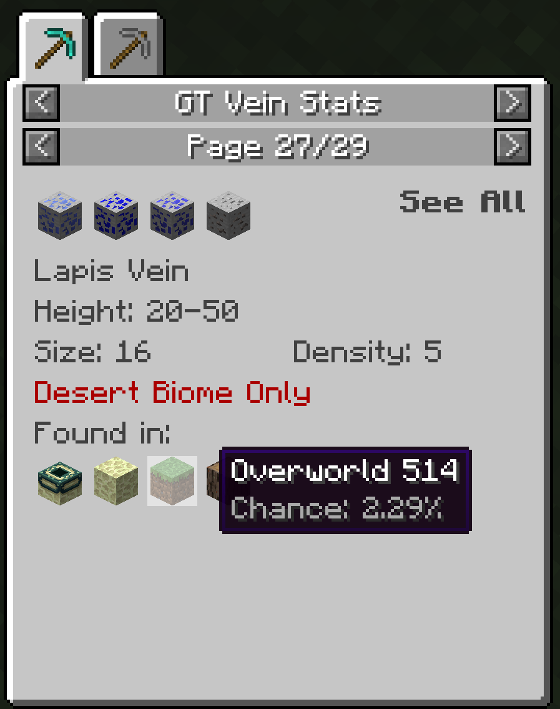
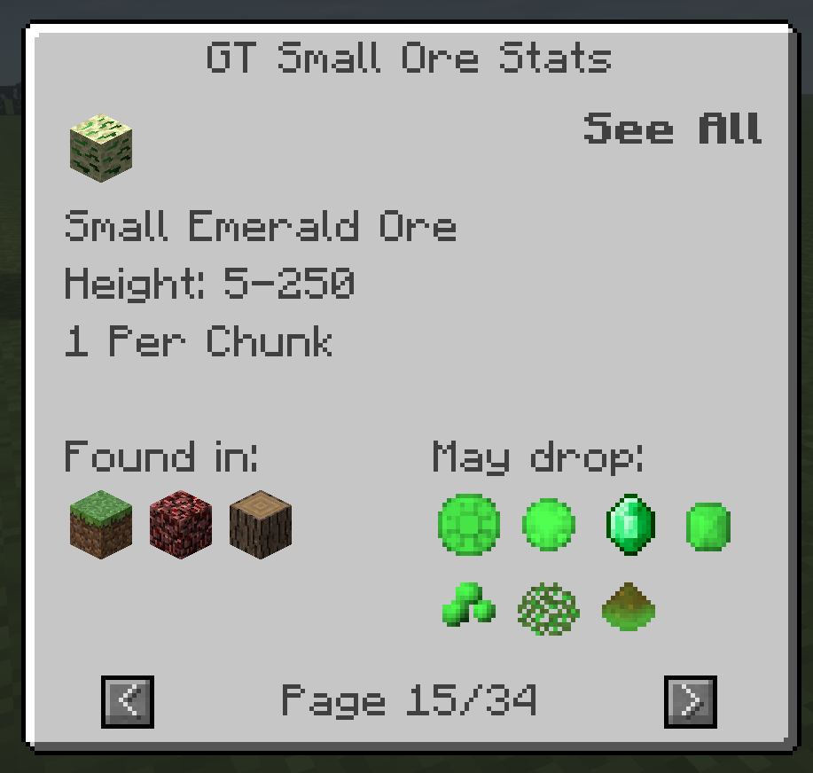

# GT NEI Ore Plugin

**WIP: GC dimension icons and Chinese localization**

This is a rewrite of [GWYOG's GTNEIOrePlugin](https://github.com/GWYOG/GTNEIOrePlugin).

The GTNH fork is nice, but it only works within GTNH because of their tier system.
This fork should work outside of GTNH. I changed the modid in case
it causes issues with other GTNH maintained mods, such as NEI.

The original project is kept at the `official` branch. Further maintenance will be on the `main` branch.

This version works with [Blood-Asp's fork](https://github.com/Blood-Asp/GT5-Unofficial)

## Screenshots



## Difference between this fork and upstream
- Rewritten basically everything
- GT6 and IE support are dropped.
- The mod need to be installed on the server because the mod registers some dimension blocks
- Redesigned the GUI layout
    - Ore names are not shown. Ore layout is shown in tooltips.
    - World names and chances are shown in tooltips
    - Worlds are sorted by descending chance
    - Restricted Biome is only shown when it's not "None"
    - Size and Density are displayed for veins
- Support dimensions in other mods through config files and API
- Galaticraft (GC) dimensions are only displayed when GC is installed
- Ore blocks cycle through GC variants if GC is installed
- Support view ores by dimension
- Support NEI-Unofficial (GTNH) features such as tab icon
- Even non GT ores can be supported through API


## Config
The config file is at `.minecraft/config/gtnoppiston.cfg`, which allows you to register dimensions
by its name.

Put each extra dimension on a separate line, with the following format:
```
<DIM_NAME>=<MODID>:<BLOCK>:<META>
```
`<DIM_NAME>` is the name of the dimension. If you are unsure, go into the game
and generate that dimension, then open `.minecraft/config/GregTech/WorldGeneration.cfg`,
search for `dimensions` and try to find it.

`<MODID>:<BLOCK>:<META>` is the block used to represent the dimension (i.e. the icon)

If this config file doesn't exist, a default one will be generated based on 
what mods are detected.
This means you can disable the default ones by deleting the lines but not the file.

## API
The API allows you to extend this mod's functionality.

Download the `api` jar from the release to get started. You also need to load
the main jar as a mod (put in `mods`), but your code should only depend on the API.

The main API class is `GTNEIOreAPI`. You can get an instance of it with `getInstance()`
after this mod's pre-init phase. 

### Add dimension to default config
To include a dimension when generating the default config. Use `registerOreWorldConfig(IOreWorldConfig)`
and provide your own implementation of `IOreWorldConfig`. The mod has one for Twilight Forest for reference.

### Add dimension
Use `createOreWorld/registerOreWorld` to add a dimension at runtime. See API for details

### Add custom veins/ores
To get started, you need to implement one of `IOreLayer` or `IOreSmall`.
`IOreLayer` is similar to GT's vein where one NEI page contains info for multiple ores.
`IOreSmall` only contains 1. When working with `IOreWorld`, you can use `getCleanedName()`
to get a relatively stable String ID for it. Feel free to use `GTOreLayer` and `GTOreSmall` as examples.

The vein object needs to be registered with the worlds in the `init()` method to make sure
chances are computed correctly. Or you can skip this and override `getChanceIn()` instead.

Once you have the vein/ore object, you need to implement `IOreManager<T>`. 
The generic parameter is either `IOreLayer` or `IOreSmall`. This is where all vein/ores
are stored and it's responsible for answering "what ores are related to this item".
Examples see `GTManagerOreLayer` and `GTManagerOreSmall`.

The manager also supplies some display properties like recipe name, mod name (NEI-GTNH only)
and tab icon (NEI-GTNH only).

The last step is to register the manager with `registerOreLayerManager` or `registerOreSmallManager`
with the API.


## Custom Vein Names
If you are making custom veins for a modpack, you can add extra localization
entries for custom vein names. For example, `gtnop.ore_stat.ore.mix.custom.00`.
See the lang files for more details

## Contribution: Supporting Extra Dimensions
Currently, the only supported extra mod (outside of GC) is Twilight Forest.

If you want to add support to other mods here's how:
- See `ModMain.java`, register the dimension in the config. Also set the default icon here
- See `assets/gtnoppiston/lang/en_US.lang`. Add the localization entry for the dimension
    - If the dimension name is "Foo Bar", the localization key is `gtnop.world.FooBar.name`
- That's it. Test it and open a PR
